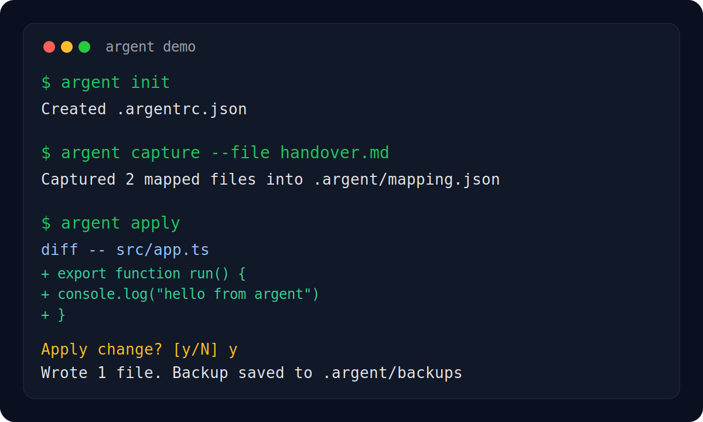

# super-ai-argent

Turn ChatGPT, Codex, and Claude output into safe, reviewable file changes.

Argent is a developer CLI that captures AI-generated code or documentation, maps it to files, shows diffs, applies approved changes, and can optionally deploy.



## Why It Exists

AI tools are good at generating code, but weak at landing that output cleanly into real projects.
Argent closes that gap.

Use it when you want to:
- take a handover from an AI chat and turn it into files
- review diffs before writing anything
- apply only the parts you approve
- keep backups of overwritten files
- optionally deploy after changes land

## Why Not Just Copy/Paste?

Manual copy/paste breaks down fast once an AI response spans multiple files. Argent gives you structure and safety instead of ad-hoc edits.

Without Argent:
- file paths are easy to lose or misread
- large responses are error-prone to paste by hand
- overwrites happen without backup
- there is no consistent review step

With Argent:
- AI output is mapped into project-relative files
- diffs are previewed before writing
- backups are created automatically
- the same workflow works for one file or many

## 30-Second Demo

```bash
argent init
argent capture --file handover.md
argent apply
```

Or as a one-command flow:

```bash
argent build --file handover.md --yes
```

## What Argent Is

Argent is not a chat model. It is the bridge between AI responses and your local project files.

Use ChatGPT, Codex, Claude, or another AI to generate code or documentation, then use Argent to:
- capture the AI response
- map it to file paths
- preview diffs
- apply the changes safely
- optionally deploy

In practice, the workflow is:
1. Ask an AI to generate file-based changes.
2. Save or pipe the response into Argent.
3. Review the diffs.
4. Apply the changes.

## Quick Start

Install in the CLI project:

```bash
npm install
npm run build
npm link
```

On Windows PowerShell with script execution disabled, use `npm.cmd`, `npx.cmd`, and `vercel.cmd` instead of the bare commands.

Then inside any project you want to work on:

```bash
argent doctor
argent init
```

If `argent doctor` works, installation is done.

## First Real Workflow

1. Go into the project you want to edit.

```bash
cd path/to/your-project
```

2. Ask your AI for a file-based response.

Recommended prompt style:

````text
Return the result as fenced code blocks.
Put a FILE marker at the top of each block, for example:

```ts
// FILE: src/app.ts
console.log("hello");
```

```md
<!-- FILE: README.md -->
# Project
```
````

3. Save that AI response as a file such as `handover.md`.

4. Capture it:

```bash
argent capture --file handover.md
```

5. Review and apply it:

```bash
argent apply
```

That is the core Argent workflow.

## Fast Workflow

If you want capture and apply in one step:

```bash
argent build --file handover.md --yes
```

If your input is a long markdown handover and file paths should be inferred from headings:

```bash
argent build --file handover.md --split-headings --infer-paths --yes
```

## How Users Should Think About Argent

Argent does not replace ChatGPT or Codex.
It makes AI output operational.

Users should understand three things:
- the AI writes the proposed content
- Argent turns that content into mapped file changes
- the user can review diffs before writing anything

## Input Options

Clipboard:

```bash
argent capture
```

Standard input:

```bash
cat handover.md | argent capture --stdin
```

Project file:

```bash
argent capture --file handover.md
```

## Recommended Output Format From The AI

Best results come from fenced code blocks with file markers near the top.

Supported inline file markers in the first 5 lines of a code block:
- `// FILE: src/app.ts`
- `# FILE: src/app.py`
- `/* FILE: styles/site.css */`
- `<!-- FILE: public/index.html -->`

If no fenced code blocks are present, `capture` treats the entire input as one document block by default. With `--split-headings`, plain markdown is split into sections, which is useful for long handovers and structured AI summaries.

## Core Commands

`argent doctor`
Checks the current environment and reports capabilities, integrations, and available workflow options.

`argent init`
Creates a default `.argentrc.json`:

```json
{
  "autoDeploy": false,
  "backupDir": ".argent/backups",
  "deployProvider": "vercel"
}
```

`argent capture`
Reads AI output, extracts fenced code blocks, detects `FILE:` markers, and saves a normalized mapping to `.argent/mapping.json`.

Useful variants:
- `argent capture --stdin`
- `argent capture --file incoming/handover.md`
- `argent capture --default-file docs/handover.md`
- `argent capture --infer-paths --docs-dir handover`
- `argent capture --output tmp/mapping.json`
- `argent capture --split-headings`

`argent apply`
Shows a line-based diff for each mapped file, asks for confirmation, writes the approved changes, and creates backups under `.argent/backups`.

Useful variants:
- `argent apply --yes`
- `argent apply --file src/app.ts`
- `argent apply --mapping tmp/mapping.json`
- `argent apply --dry-run`
- `argent apply --require-changes`
- `argent apply --deploy`
- `argent apply --deploy --deploy-provider netlify`

`argent build`
Runs document ingestion and apply in one step.

Useful variants:
- `argent build --file incoming/handover.md --split-headings --infer-paths --yes`
- `argent build --file incoming/handover.md --split-headings --infer-paths --yes --deploy`
- `argent build --file incoming/handover.md --split-headings --infer-paths --yes --deploy --deploy-provider netlify`

`argent deploy`
Triggers a production deployment for the current project using the configured provider.

Useful variants:
- `argent deploy`
- `argent deploy --provider netlify`
- `argent deploy --yes`

## Safety Rules

- File paths are normalized to project-relative paths.
- Absolute paths, UNC paths, and `..` traversal are rejected.
- Existing files are backed up before overwrite.
- Saved mappings are revalidated when loaded.

## Example End-To-End

Create a test folder and try this:

```bash
mkdir demo-agent
cd demo-agent
argent init
```

Create `handover.md` with:

````md
```txt
FILE: src/hello.txt
hello from argent
```
````

Then run:

```bash
argent capture --file handover.md
argent apply --yes
```

You should get:

```bash
src/hello.txt
```

## Development

Install dependencies:

```bash
npm install
```

Build:

```bash
npm run build
```

Primary verification path:

```bash
npm test
```

Additional checks:

```bash
npm run smoke
npm run test:vitest
```

Release checks:

```bash
npm pack --dry-run
```

Publishing:
- The package tarball is intentionally limited via the `files` allowlist in `package.json`.
- GitHub Actions can publish from a version tag or a manual rerun using `.github/workflows/publish.yml` once npm trusted publishing is configured for this repository.
- See `PUBLISHING.md` for the current end-to-end local publish and release steps.

Notes:
- `npm test` runs the in-process core verifier and works in restricted environments.
- `npm run test:vitest` keeps the original Vitest suite available, but it may fail in locked-down sandboxes that block process spawning.
